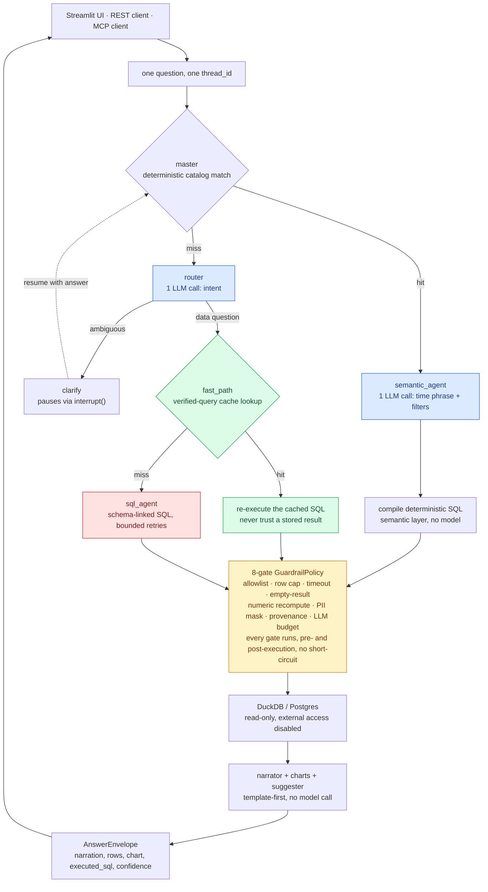

# OmniAgent

A governed answer engine for tabular data. Ask a question in plain English,
get back a number with the SQL that produced it, or a clear refusal instead
of a confident guess. Semantic layer first, guarded SQL fallback second,
a deterministic gate stack around both.

## The scorecard

Regenerated fresh from real data on every run, never hand-assembled:

```bash
python scripts/generate_samples.py
python scripts/load_warehouse.py
python scripts/run_eval.py
```

```text
metric                           n     mean   ci_low  ci_high
-------------------------------------------------------------
execution_accuracy             147   100.0%   100.0%   100.0%
route_accuracy                 147   100.0%   100.0%   100.0%
metric_match_accuracy          147   100.0%   100.0%   100.0%
redteam_refusal_rate             6   100.0%   100.0%   100.0%
```

147 golden questions across two packs (e-commerce, SaaS), generated
backwards from real execution against the real warehouse, not hand-written
(see [docs/adr/0011](docs/adr/0011-backwards-generated-golden-set.md)). 6
red team cases (prompt injection, destructive SQL, PII exfiltration), each
scripted to keep trying its attack on every retry, refused every time by
the gate stack, not by a model declining.

## The same SQL, gated or not

```bash
python scripts/compare_governed_vs_raw.py
```

Runs the red team's own SQL strings two ways: once with no gates at all
against a disposable copy of the warehouse, once through the real gate
stack. As of this writing: **4 of 6 execute with no gates**, all 6 are
refused when governed. The two that fail unguarded do so by DuckDB dialect
luck (legacy syntax the parser happens to reject), not by design, which is
the actual point: a deterministic gate stack holds regardless of the SQL
dialect, the model, or the day. Chart written to `reports/governed_vs_raw.html`.

## 90 seconds, end to end

```bash
python scripts/demo.py
```

Five acts, all real code, no GROQ_API_KEY required: the trap above, an
answer card with a chart, a genuinely ambiguous question that pauses for
clarification and resumes, the same governed graph answering through MCP
instead of a human, then the scorecard.

## How it decides

Every box below is real code, not a plan. Blue nodes are the only places a
model is called at all, and each one answers a single narrow question, not
"what should happen next" (see
[docs/adr/0002](docs/adr/0002-gated-autonomy-deterministic-routing.md)).
Green is the path that skips the model entirely. Red is the one place a
model writes SQL directly, which is exactly why it carries the heaviest
gating.



A catalog hit costs exactly one model call for the entire turn. A
fast-path hit costs zero, because the SQL was already verified, though it
still re-executes against current data rather than serving a stored
answer. The fallback (`sql_agent`) is the one place a model writes SQL
from scratch, so it is the one path that runs schema-linked generation
with a bounded self-correction loop and pays for it with the most retries
and the strictest scrutiny. Narration, chart selection, and follow-up
suggestions are template-first everywhere, always zero extra calls (see
[docs/adr/0001](docs/adr/0001-semantic-layer-first-guarded-fallback.md)).

## Where the cost actually goes

- **One model call is the default, not the exception.** A catalog-matched
  question (the common case in any well-modeled domain) makes exactly one
  narrow LLM call -- extracting a time phrase and filters -- then compiles
  deterministic SQL and narrates from a template. No routing decision, no
  narration, no chart choice ever costs a model call.
- **The verified-query cache is the real cost saver, not a caching
  trick.** A thumbs-up on a fallback answer stores its SQL. A later
  paraphrase of the same question skips the model entirely and
  re-executes that stored query against current data -- cached at the
  *query* level, not the *answer* level, so it can never go stale (see
  [docs/adr/0006](docs/adr/0006-verified-query-fast-path-reexecutes.md)).
  A same-shape-different-metric near miss scores high enough on embedding
  similarity to fool a low threshold, so this path only trusts a hit
  above roughly 0.9 cosine similarity, calibrated against the real
  embedder, not guessed.
- **Cheap model for routine calls, a different model where it's worth
  it.** `build_governed_graph` takes an independent `model_id` for the
  main path, `router_model_id` for intent routing, and
  `sql_agent_model_id` for the guarded fallback -- an operator can point
  routine extraction at a fast, inexpensive tier (Groq's `gpt-oss-20b`
  runs about $0.075 in / $0.30 out per million tokens) and reserve a
  stronger model for the one path where a model writes SQL directly. This
  is a deployment choice made once at startup, not automatic runtime
  escalation -- `OmniState` carries a `tier_bump` field for that kind of
  adaptive routing, and it is honestly unused today, not wired to
  anything.
- **Prompt caching is the provider's job, not a feature built here.**
  `ModelCapabilities.prompt_caching` records that Groq caches repeated
  prompt prefixes automatically at the API level; OmniAgent's own prompts
  are already narrow and templated (see `adapters/llm/prompting.py`), so
  they are exactly the repeated-prefix shape that caching helps with, but
  the caching itself happens on Groq's side, not in this codebase.

## Try it

```bash
git clone <this repo> && cd omniagent-ai-data-analyst
just install                    # uv sync --locked --all-extras --dev
python scripts/generate_samples.py
python scripts/load_warehouse.py
just eval                       # the scorecard above
just compare                    # the governed-vs-raw chart
just demo                       # the 90-second walkthrough

export GROQ_API_KEY=...         # a real model, for the actual services
just serve                      # REST API on :8000
just serve-mcp                  # MCP server, stdio by default

just serve &                    # keep the API running, then pick a UI:
streamlit run omniagent/channels/streamlit_app.py   # on :8501
just web-install && just web    # Next.js app on :3000 -- same API, same gates, no Streamlit

docker compose up --build       # the whole stack (init, api, ui, web): see below
```

`docker compose up` builds one image, generates both packs' sample data
and loads the warehouse in an `init` service, then brings up the REST API
(`:8000`) and two independent frontends against it -- the Streamlit UI
(`:8501`) and a Next.js app (`:3000`); an `mcp` service is available behind
`docker compose --profile mcp up`. Needs `GROQ_API_KEY` in the environment
(or a `.env` file) to actually answer questions; without one it still
builds, generates data, and serves `/health`/`/datasets`, failing fast
with a clear error on `/ask` instead of guessing.

## What's actually here

- **Semantic layer first** ([docs/adr/0001](docs/adr/0001-semantic-layer-first-guarded-fallback.md)):
  a catalog match compiles to deterministic SQL with one narrow LLM call
  for filter/time extraction. No catalog match escalates to a guarded SQL
  fallback with schema linking and a bounded self-correction loop, behind
  the same gate stack.
- **A deterministic gate stack, not an ML guardrail** ([0005](docs/adr/0005-deterministic-gate-stack.md)):
  SQL allowlist, row cap, timeout, empty-result abstention, numeric
  recompute against ground truth, PII masking, provenance, LLM budget.
  Every gate runs, not just the first that fails, for a full audit trail.
- **Durable, resumable clarification** ([0007](docs/adr/0007-interrupt-based-clarification.md)):
  a genuinely ambiguous question pauses the graph via LangGraph's
  `interrupt()` and resumes exactly where it left off once answered.
- **An evaluation harness with published numbers** ([0011](docs/adr/0011-backwards-generated-golden-set.md)):
  golden sets generated backwards from real execution, never checked in as
  static data, so they can't drift out of sync with the packs or warehouse.
- **MCP with no raw-SQL tool** ([0012](docs/adr/0012-mcp-mirrors-rest-no-raw-sql.md)):
  the same four capabilities (discover, ask, resume, feedback) both UIs
  (Streamlit and the Next.js app) get, nothing more direct, over the same
  gate stack.
- **Two real datasets, one real engine, one real semantic provider**:
  e-commerce and SaaS packs, fully exercised through DuckDB and a
  self-contained YAML semantic layer. Postgres and dbt/MetricFlow are
  written to their full ports but honestly documented as open, not faked
  (see [BUILD_STATUS.md](BUILD_STATUS.md)).

Full phase-by-phase status, what's genuinely done versus honestly open, and
every real bug this build's own validate-then-fix discipline caught: see
[BUILD_STATUS.md](BUILD_STATUS.md). Architecture decisions, one per real
design choice made across the build: [docs/adr/](docs/adr/). Running a
pilot: [docs/PILOT_RUNBOOK.md](docs/PILOT_RUNBOOK.md).

## License

MIT. See [LICENSE](LICENSE).
